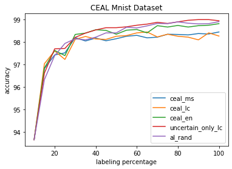
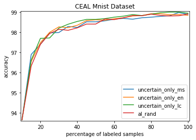

# CEAL_MNIST
Cost Effective Active Learning on Mnist dataset with LeNet

MNIST:http://yann.lecun.com/exdb/mnist/

LeNet:http://yann.lecun.com/exdb/lenet/

# Environment
Pytorch 1.3.1

# Result

AL_RAND: Randomly select samples with manual annotation. 

CEAL_EN: CEAL with entropy criteria

CEAL_MS: CEAL with marginal sampling criteria

CEAL_LC: CEAL with least confidence criteria

Uncertain_Only: Common active learning w/o high confidence sample pseudo-labeling

Comparison Results and Analysis:
  
  Starting from the same initialization, CEAL improves better than common active learning (CAL) and random samples(AL_RAND) at first (an average of 0.2% better than CAL and 0.4% better than AL_RAND). But they become unstable comparing to common active leraning after first several iterations.    

